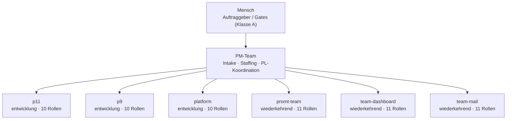

# Organigramm der Gesamtorganisation

*Generiert durch `platform/scripts/organigramm.py` — nicht von Hand pflegen. Je Einheit liegt ein eigenes `ORGANIGRAMM.md` im Repo.*

| Einheit | Typ | Profil | Status | Datenklasse | Besetzungen |
|---|---|---|---|---|---|
| p0 | projekt | entwicklung | abgeschlossen | intern | — |
| p1 | projekt | entwicklung | ohne Status | intern | — |
| p10 | projekt | entwicklung | abgeschlossen | intern | — |
| p11 | projekt | entwicklung | aktiv | intern | — |
| p12 | projekt | entwicklung | abgeschlossen | intern | — |
| p13 | projekt | entwicklung | ohne Status | intern | — |
| p2 | projekt | entwicklung | ohne Status | intern | — |
| p3 | projekt | entwicklung | ohne Status | intern | — |
| p4 | projekt | entwicklung | ohne Status | intern | — |
| p5 | projekt | entwicklung | ohne Status | intern | — |
| p7 | projekt | entwicklung | ohne Status | intern | — |
| p8 | projekt | entwicklung | ohne Status | intern | — |
| p9 | projekt | entwicklung | aktiv | intern | — |
| platform | plattform | entwicklung | aktiv | intern | PROB@platform |
| pm | pm | wiederkehrend | aktiv | intern | COACH@pm, PL@pm, QM@pm |
| promt-team | projekt | wiederkehrend | aktiv | sensibel | PROMPT-OPT@promt-team |
| team-dashboard | projekt | wiederkehrend | aktiv | intern | DASH-RED@team-dashboard |
| team-mail | projekt | wiederkehrend | aktiv | sensibel | MAIL-RED@team-mail |
